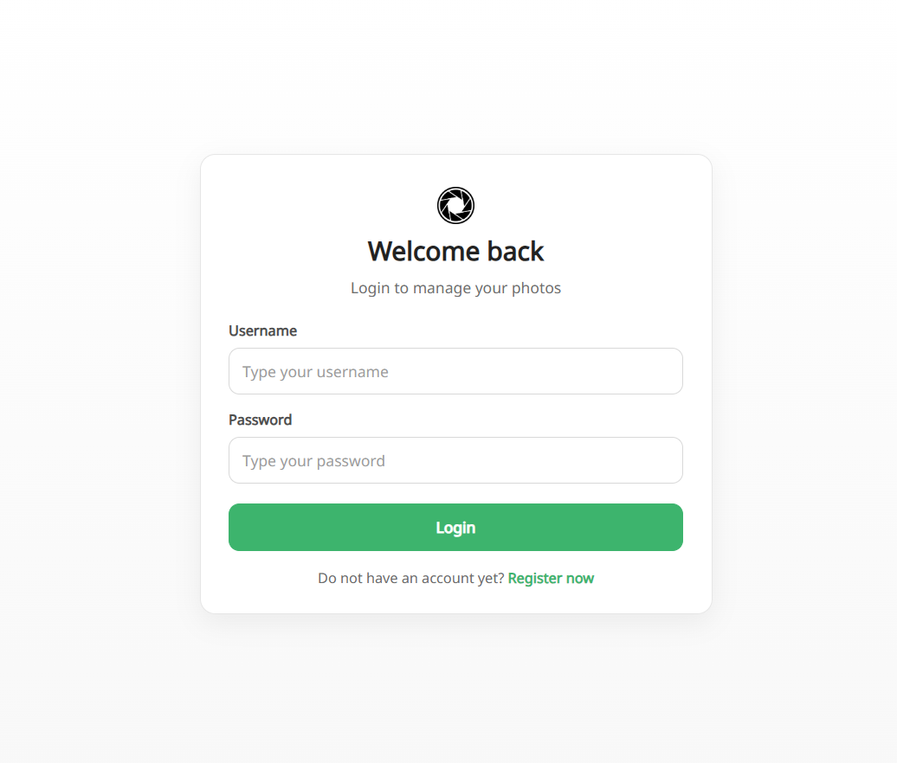
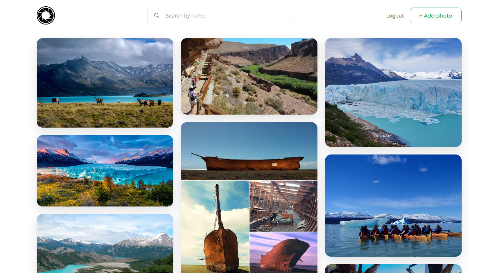
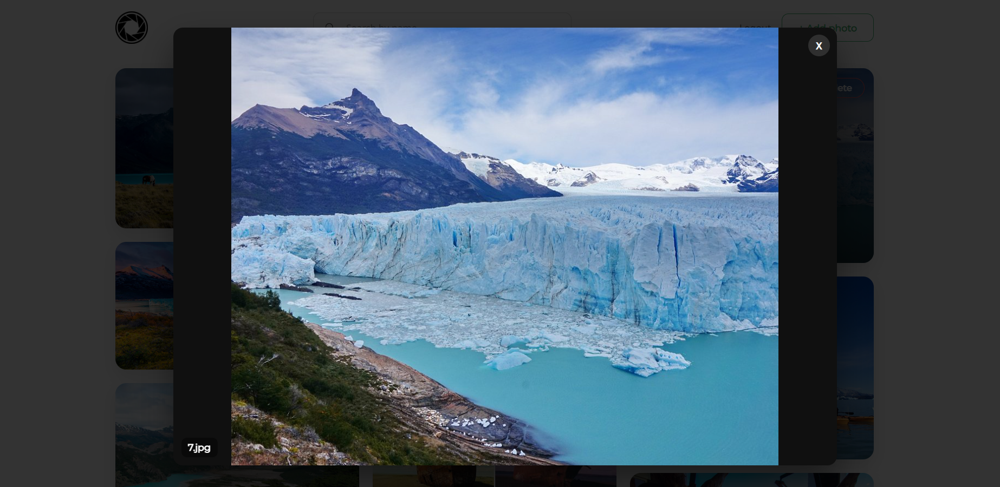

# My Unsplashed

Aplicacion full stack para subir, listar, buscar, previsualizar y eliminar imagenes por usuario.

## Demo

- Frontend (Vercel): `pendiente`
- API (Backend): `pendiente`

## Capturas

### Login



### Home



### Preview de imagen



## Features

- Registro e inicio de sesion con JWT en cookie `httpOnly`
- Sesion persistente con endpoint `/auth/me`
- Subida de imagenes (UploadThing)
- Almacenamiento y lectura de metadata en Supabase
- Busqueda por nombre de imagen
- Eliminacion de imagenes por usuario autenticado

## Stack

- Frontend: React 19, Vite, React Router, Styled Components
- Backend: Node.js, Express, JWT, Multer, UploadThing
- Base de datos: Supabase (PostgreSQL)

## Estructura

```text
MY-UNSPLASHED/
  backend/
    src/
  frontend/
    src/
```

## Variables de entorno

### Backend (`backend/.env`)

```env
PORT=3001
FRONTEND_URL=http://localhost:5173
JWT_SECRET=your_jwt_secret
SUPABASE_SERVICE_ROLE_KEY=your_supabase_service_role_key
UPLOADTHING_SECRET=your_uploadthing_secret
NODE_ENV=development
```

### Frontend (`frontend/.env`)

```env
VITE_API_URL=http://localhost:3001/api/v1
```

## Ejecutar localmente

### 1. Backend

```bash
cd backend
npm install
npm run dev
```

### 2. Frontend

```bash
cd frontend
npm install
npm run dev
```

## Endpoints principales

- `POST /api/v1/auth/register`
- `POST /api/v1/auth/login`
- `GET /api/v1/auth/me`
- `DELETE /api/v1/auth/logout`
- `GET /api/v1/images`
- `POST /api/v1/images`
- `DELETE /api/v1/images/:id`
